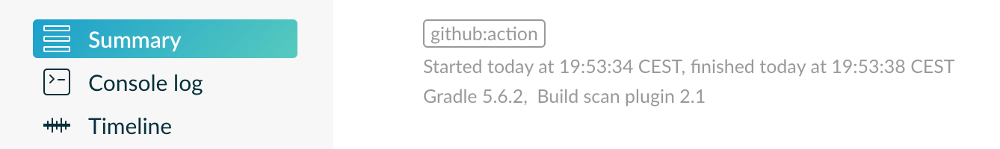

# Gradle Plugin for Github Actions

This Gradle plugin allows your build to easily get Github Actions environment and tag Gradle Build Scans accordingly.

Also see the [Gradle Command](https://github.com/marketplace/actions/gradle-command) Github Action that allows to execute Gradle commands.

[](https://github.com/eskatos/gradle-github-actions-plugin/actions)

## Usage

```kotlin
plugins {
    id("org.nosphere.gradle.github.actions") version "1.0.0"
}

// for example:
if(githubActions.running.get()) {
    val commitId = githubActions.environment.sha.get()
}
```

If you have the Gradle Build Scan plugin applied, or use `--scan`, your build scans will automatically be tagged `github:action` and have the following custom values attached:




https://scans.gradle.com/s/o5bk2fu3zwm3y

You can disable that or change the tag and values prefix:

```kotlin
githubActions.buildScan {
    autoTag.set(false)
    autoTagPrefix.set("ga:")
}
```

## Compatibility

* Minimum Java version `1.8`
* Minimum Gradle version `5.2`
* Minimum Build Scan version `1.1`
