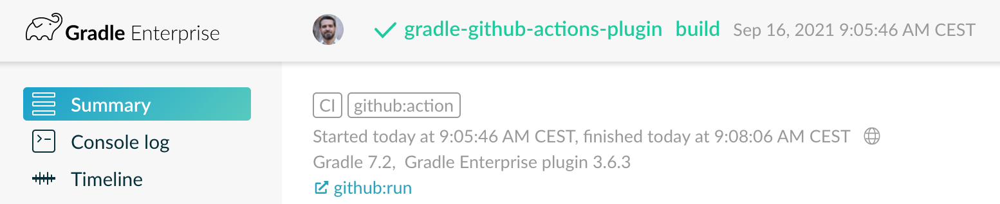

# Gradle Plugin for Github Actions

This Gradle plugin allows your build to easily get Github Actions environment and tag Gradle Build Scans accordingly.

Also see the [Gradle Command](https://github.com/marketplace/actions/gradle-build-action) Github Action that allows to execute Gradle commands.

[](https://github.com/eskatos/gradle-github-actions-plugin/actions)

## Usage

```kotlin
plugins {
    id("org.nosphere.gradle.github.actions") version "1.3.1"
}

// for example:
if (githubActions.running.get()) {
    println("Commit SHA: ${githubActions.environment.sha.get()}")
}
```

If you have the Gradle Enterprise or Gradle Build Scan plugin applied, or use `--scan`, your build scans will automatically be tagged `github:action`, have a link to the GitHub Action run and have the following custom values attached:




https://scans.gradle.com/s/iputsr55ifwtq

You can disable that or change the tag and values prefix:

```kotlin
githubActions.buildScan {
    autoTag.set(false)
    autoTagPrefix.set("ga:")
}
```

## Compatibility matrix

| Plugin | Min Java | Min Gradle | Max Gradle | Build Scan | Configuration Cache
| --- | --- | --- | --- | --- | ---
| `1.3.x` | `1.8` | `6.1` | `7.x` | `>= 3.0` | 🟢
| `1.2.x` | `1.8` | `6.1` | `7.x` | `>= 3.0` | 🟢
| `1.1.x` | `1.8` | `5.2` | `6.x` | `>= 1.1` | 🔴
| `1.0.x` | `1.8` | `5.2` | `6.x` | `>= 1.1` | 🔴
